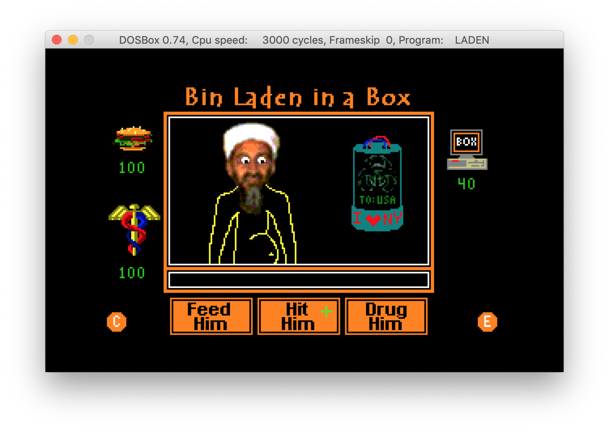

# Bin Laden in a box
An old project from 2002 - It's a tamagotchi, only this time the creature is bin laden. 

The code is so bad, but the nostalgia was too much, I had to share this :)

## Instructions

Step-by-step... Because it's annoying to Google stuff.

### Preperation
1. `mkdir ~/dosbox && cd "$_"`
- `git clone https://github.com/thedp/laden_in_box.git`
- Download [Turbo C 2.01](http://cc.embarcadero.com/item/25636) to `~/dosbox/`
- Extract TC Disks to a single directory: `mkdir tc201/full ; cp -R tc201/Disk*/ tc201/full/`
- Install [DOSBox](https://www.dosbox.com)

### Inside DOSBox
- Open DOSBox, and execute `mount c ~/dosbox`, then `c:`
- Execute `TC201\FULL\INSTALL.EXE`
- Run `TC\TC.EXE`
- Change `Options -> Model` from `Small` to `Large`
- `File -> Load` the file `LADEN\LADEN.C`
- `Compile -> Make EXE file`
- ?
- Profit

## Troubleshooting
- Making in-game mouse to work on MacOS: Use `fn + Ctrl + F10` to switch mouse to DOSBox, and back.

- If the reaction is laggy, [increase DOSBox memory](https://www.dosbox.com/wiki/DOSBox_FAQ#Increasing_memory_size).
